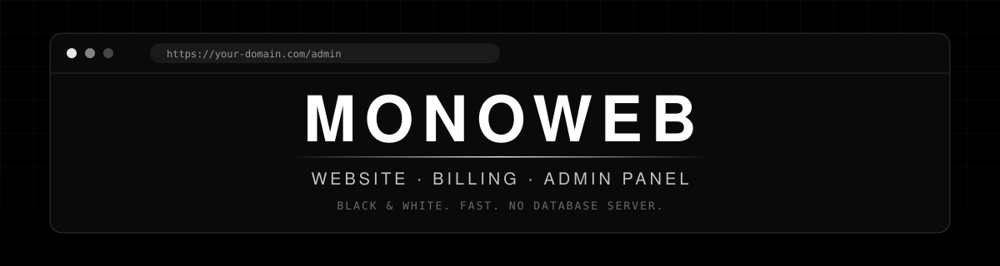
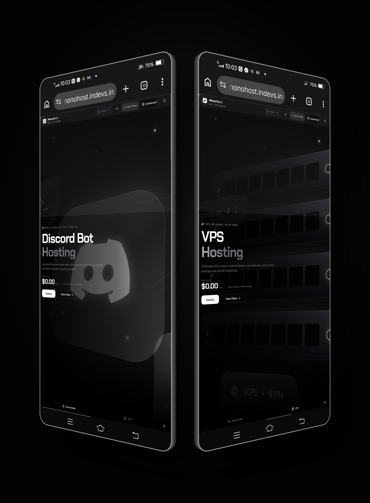
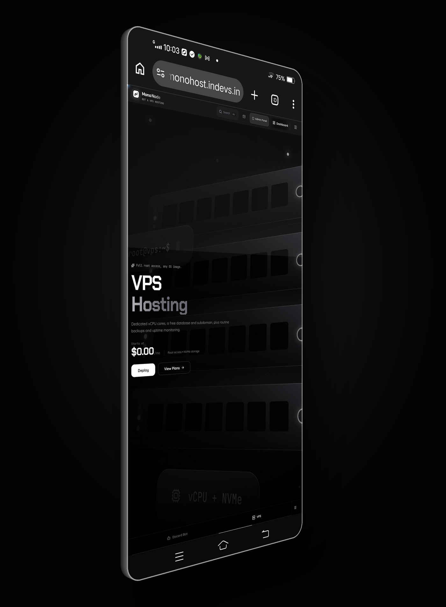
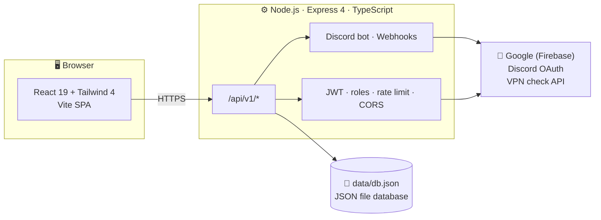
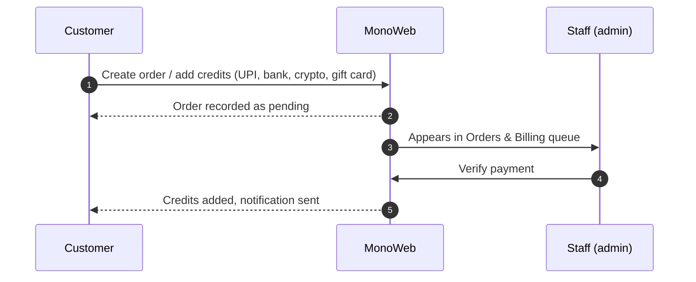
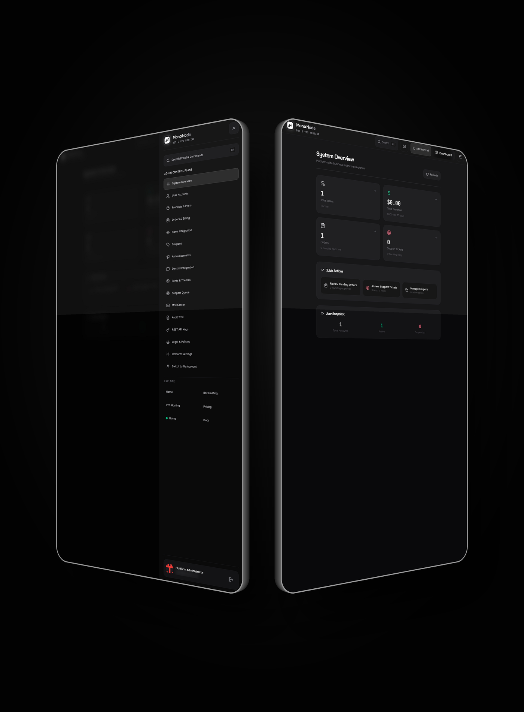
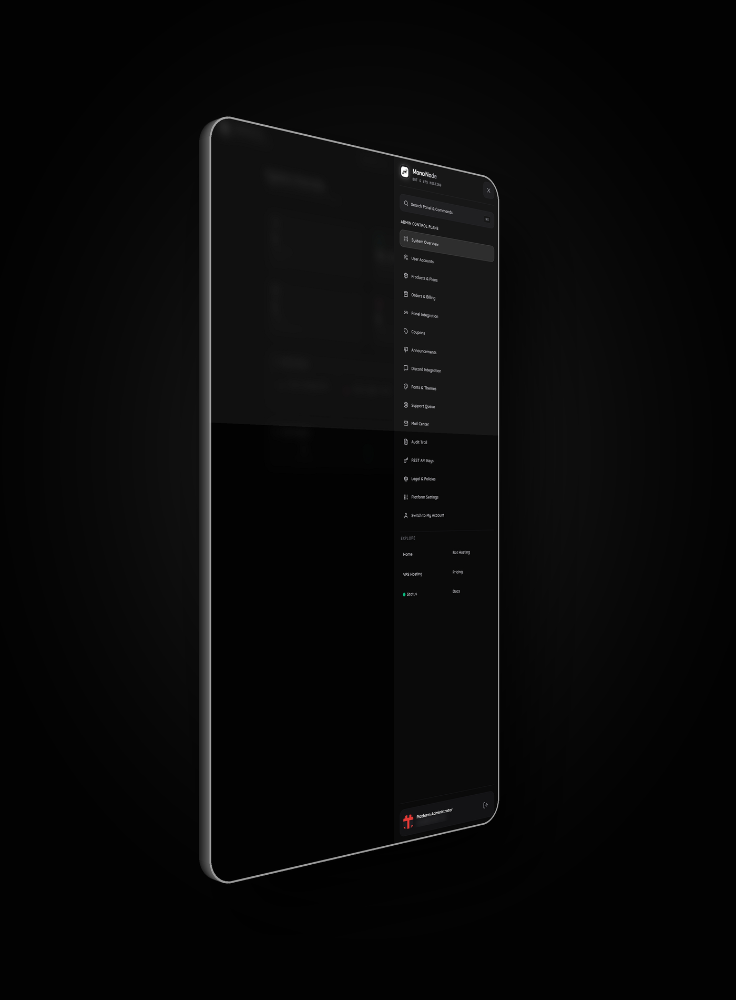
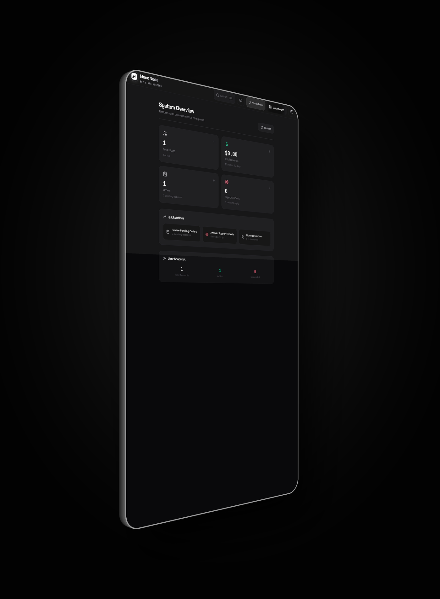

<div align="center">



<br/>

**The website, billing system and admin panel behind MonoNode — Discord Bot Hosting & VPS Hosting.**
<br/>
<sub>Black & white. Fast. Built to be run and edited by the people who host on it.</sub>

<br/><br/>

[](LICENSE)
[](https://react.dev)
[](https://www.typescriptlang.org)
[](https://vite.dev)
[](https://tailwindcss.com)
[](https://nodejs.org)
[](CONTRIBUTING.md)

<br/>

[**Preview**](#-preview) ·
[**Features**](#-features) ·
[**Quick start**](#-quick-start) ·
[**Architecture**](#-architecture) ·
[**Admin panel**](#-admin-panel) ·
[**Config**](#-configuration) ·
[**Deploy**](#-production-deployment) ·
[**Security**](#-security-checklist) ·
[**Contribute**](#-contributing)

</div>

<br/>

---

## ◼ What is MonoWeb?

MonoWeb is the full-stack web platform for **MonoNode**. One repo gives you a public marketing site, customer accounts, a billing and order system, a support desk, an in-dashboard mail inbox and a complete admin panel — with **no external database to set up**.

It sells exactly two products:

<table>
<tr>
<td width="50%" align="center">

### 🤖 Discord Bot Hosting
Plans, pricing and features pulled live from your product catalogue.

</td>
<td width="50%" align="center">

### 🖥️ VPS Hosting
Plans, pricing and features pulled live from your product catalogue.

</td>
</tr>
</table>

> [!NOTE]
> MonoWeb is a trimmed, re-themed and extended build of the open-source **AetherPanel** codebase. It keeps only the **website and billing side** of a hosting business and contains **no game-server management**. It is not a server control panel.

---

## ◼ Preview

<div align="center">



</div>

<table>
<tr>
<td width="50%" align="center">


**Discord Bot Hosting**
<br/><sub>Node.js, Python, Bun & Go, always on</sub>

</td>
<td width="50%" align="center">



**VPS Hosting**
<br/><sub>Full root access, any OS image</sub>

</td>
</tr>
</table>

---

## ◼ At a glance

<table>
<tr>
<td align="center" width="25%"><h3>2</h3><sub>Products sold</sub></td>
<td align="center" width="25%"><h3>5</h3><sub>User roles</sub></td>
<td align="center" width="25%"><h3>0</h3><sub>DB servers needed</sub></td>
<td align="center" width="25%"><h3>4</h3><sub>Payment methods</sub></td>
</tr>
</table>

---

## ✦ Features

<details open>
<summary><b>🌐 Public website</b></summary>
<br/>

| | |
|---|---|
| **Home page** | Fully redesigned black & white layout: ticker, product cards, infrastructure section, stats, FAQ |
| **Live pricing** | Product cards read prices and feature lists from your real plans, so the site never drifts from what you sell |
| **Product pages** | Dedicated **Bot Hosting**, **VPS Hosting** and **Pricing** pages |
| **Status page** | Incident tracking and scheduled maintenance |
| **Docs & legal** | Docs page plus editable legal pages (Terms, Privacy, …) |

</details>

<details open>
<summary><b>🔐 Accounts & authentication</b></summary>
<br/>

- Email + password sign-up and login
- **Google** sign-in (Firebase) and **Discord** OAuth, both optional
- Role system: `user` · `support` · `moderator` · `admin` · `super_admin`
- JWT sessions, hashed passwords (bcryptjs), API rate limiting and a CORS allow-list
- Optional **VPN / proxy blocking** to reduce abuse

</details>

<details open>
<summary><b>👤 Customer dashboard</b></summary>
<br/>

| Area | What customers get |
|---|---|
| **Overview** | Account summary, credits balance, order history |
| **Billing & Checkout** | Add credits, place orders, redeem **coupons** |
| **Support Tickets** | Open and follow tickets with staff |
| **Mail** | In-dashboard inbox with unread counter, mark-all-read, delete |
| **Activity Log** | Account activity history |
| **Settings** | Link a Discord account, configure webhooks |
| **Quick Links** | One-click sidebar shortcuts to whatever you choose ([details](#-panel-integration--quick-links)) |

</details>

<details open>
<summary><b>💳 Billing</b></summary>
<br/>

Pay with **UPI**, **bank transfer**, **crypto** or **gift cards**.

Every manual payment is **verified by staff before credits are added**, so nothing is granted on trust. Coupons, orders and pending approvals are all managed from the admin panel.

> [!WARNING]
> Instant card payments are **not available**. The Stripe toggle exists as a placeholder only and is blocked server-side until a real processor is integrated.

</details>

<details open>
<summary><b>✉️ Mail</b></summary>
<br/>

A built-in inbox so you can message customers without leaving the platform.

- Staff (`support`, `moderator`, `admin`, `super_admin`) can message **one user** or **broadcast to everyone**
- Customers get an inbox with an **unread counter**
- Admins see every sent message with **read receipts** (e.g. `12/40 read`), grouped per broadcast

</details>

<details open>
<summary><b>🎨 Themes & fonts</b></summary>
<br/>

Ships with the **MonoNode Black & White** theme. **Chakra Petch** for headings and the logo, **Quicksand** for body text. Switch themes and fonts from **Admin → Fonts & Themes**.

</details>

<details open>
<summary><b>💬 Discord integration</b></summary>
<br/>

Optional account linking plus account and billing notifications through a Discord bot and webhooks.

</details>

---

## ✦ Role matrix

| Capability | `user` | `support` | `moderator` | `admin` | `super_admin` |
|---|:-:|:-:|:-:|:-:|:-:|
| Customer dashboard | ✅ | ✅ | ✅ | ✅ | ✅ |
| Send mail (one / broadcast) | ➖ | ✅ | ✅ | ✅ | ✅ |
| Admin panel access | ➖ | ⚙️ | ⚙️ | ✅ | ✅ |

<sub>✅ full access · ⚙️ scoped by the server's role checks · ➖ none. Exact permissions are enforced in <code>server/auth.ts</code>.</sub>

---

## ✦ Architecture



### Request lifecycle



### Tech stack

| Layer | Tools |
|---|---|
| **Frontend** | React 19, TypeScript, Vite 6, Tailwind CSS 4, Motion, Lucide icons |
| **Backend** | Node.js, Express 4, TypeScript (run with `tsx`) |
| **Storage** | Local JSON file database (`data/db.json`) — no database server |
| **Auth** | JSON Web Tokens, bcryptjs, Firebase (Google sign-in), Discord OAuth2 |
| **Integrations** | discord.js 14 |

---

## ✦ Admin panel

<div align="center">



</div>

<table>
<tr>
<td width="50%" align="center">



**Admin control plane**
<br/><sub>Every admin tool in one sidebar</sub>

</td>
<td width="50%" align="center">



**System overview**
<br/><sub>Users, revenue, orders and tickets at a glance</sub>

</td>
</tr>
</table>

<table>
<tr>
<td width="33%" valign="top">

**People**
- User Accounts
- Support Queue
- Mail Center

</td>
<td width="33%" valign="top">

**Commerce**
- Products & Plans
- Orders & Billing
- Coupons

</td>
<td width="33%" valign="top">

**Platform**
- System Overview
- Announcements
- Discord Integration
- Fonts & Themes
- Audit Trail
- REST API Keys
- Legal & Policies
- Platform Settings
- Panel Integration

</td>
</tr>
</table>

**System Overview** shows total users, total revenue (with the last 30 days), orders with pending approvals, and support tickets awaiting a reply. **Quick Actions** jump straight to pending orders, open tickets and coupons, and **User Snapshot** splits accounts into total, active and suspended.

### 🔗 Panel Integration & Quick Links

**Admin → Panel Integration** lets you add, edit and remove **Quick Links** (label + URL, up to **12**), for example a Discord bot panel, a VPS panel or a status page.

- Links that have a URL appear in every customer's dashboard sidebar and open in a new tab
- Optional **auto-provisioning** (Pterodactyl / Pelican-compatible panel via API) is available under *Advanced* and is **off by default**

---

## ⚡ Quick start

> [!IMPORTANT]
> Requires **Node.js 18+** and **npm**.

<details open>
<summary><b>1 · Clone & install</b></summary>

```bash
git clone https://github.com/Srccodeusr/MonoWeb.git
cd MonoWeb
npm install
```

</details>

<details open>
<summary><b>2 · Configure</b></summary>

```bash
cp .env.example .env
```

Set at least these three values **before the first start**:

```env
JWT_SECRET="a-long-random-string"
AETHER_ADMIN_EMAIL="you@yourdomain.com"
AETHER_ADMIN_PASSWORD="a-strong-password"
```

Generate a strong secret:

```bash
node -e "console.log(require('crypto').randomBytes(48).toString('hex'))"
```

> [!CAUTION]
> If `AETHER_ADMIN_EMAIL` / `AETHER_ADMIN_PASSWORD` are not set, the first-run admin account falls back to built-in default credentials. **Always set your own.**

</details>

<details open>
<summary><b>3 · Run in development</b></summary>

```bash
npm run dev
```

Open **http://localhost:3000** and sign in with the admin account from your `.env`.

</details>

<details open>
<summary><b>4 · Build & run in production</b></summary>

```bash
npm run build
npm start
```

The server listens on port **3000**. Put it behind a reverse proxy for HTTPS and set `APP_URL` and `ALLOWED_ORIGINS` to your public domain.

</details>

### Scripts

| Command | What it does |
|---|---|
| `npm run dev` | Starts the API and the Vite dev server together |
| `npm run build` | Builds the frontend and bundles the server into `dist/` |
| `npm start` | Runs the production build |
| `npm run lint` | Type-checks the whole project (`tsc --noEmit`) |
| `npm run clean` | Removes build output |

---

## ⚙ Configuration

| Variable | Required | Description |
|---|:-:|---|
| `JWT_SECRET` | ✅ | Secret used to sign login tokens. Use a long random value. |
| `AETHER_ADMIN_EMAIL` | ✅ | Email of the first super admin created on first start. |
| `AETHER_ADMIN_PASSWORD` | ✅ | Password of the first super admin. |
| `APP_URL` | ✅ prod | Public URL of your site, used for OAuth callbacks. |
| `ALLOWED_ORIGINS` | ✅ prod | Comma-separated list of allowed CORS origins. |
| `AETHER_INSTALLATION_ID` / `AETHER_INSTALLATION_SECRET` | ➖ | Identity keys for this installation. |
| `TRUST_PROXY` | ➖ | Set to `false` if you are **not** behind a reverse proxy. |
| `VPN_CHECK_API_KEY` | ➖ | Key for the VPN/proxy detection provider. |
| `DISCORD_CLIENT_ID` / `DISCORD_CLIENT_SECRET` / `DISCORD_REDIRECT_URI` | ➖ | Enables Discord OAuth login. |
| `DISCORD_BOT_TOKEN` | ➖ | Enables the Discord bot integration. |
| `VITE_FIREBASE_*` | ➖ | Firebase web-app credentials for Google sign-in. |
| `NODE_ENV` | ➖ | `development` or `production`. |

---

## 🚀 Production deployment

<details>
<summary><b>Nginx reverse proxy</b></summary>

```nginx
server {
    listen 80;
    server_name your-domain.com;
    return 301 https://$host$request_uri;
}

server {
    listen 443 ssl http2;
    server_name your-domain.com;

    # ssl_certificate / ssl_certificate_key via certbot

    location / {
        proxy_pass http://127.0.0.1:3000;
        proxy_set_header Host $host;
        proxy_set_header X-Real-IP $remote_addr;
        proxy_set_header X-Forwarded-For $proxy_add_x_forwarded_for;
        proxy_set_header X-Forwarded-Proto $scheme;
    }
}
```

</details>

<details>
<summary><b>Caddy (automatic HTTPS)</b></summary>

```caddy
your-domain.com {
    reverse_proxy 127.0.0.1:3000
}
```

</details>

<details>
<summary><b>Keep it running with systemd</b></summary>

```ini
# /etc/systemd/system/monoweb.service
[Unit]
Description=MonoWeb
After=network.target

[Service]
WorkingDirectory=/opt/MonoWeb
ExecStart=/usr/bin/npm start
Restart=always
Environment=NODE_ENV=production
User=monoweb

[Install]
WantedBy=multi-user.target
```

```bash
sudo systemctl daemon-reload
sudo systemctl enable --now monoweb
```

</details>

<details>
<summary><b>Keep it running with PM2</b></summary>

```bash
npm i -g pm2
npm run build
pm2 start npm --name monoweb -- start
pm2 save && pm2 startup
```

</details>

---

## 🛡 Security checklist

- [ ] Set a long random `JWT_SECRET`
- [ ] Set your own `AETHER_ADMIN_EMAIL` and `AETHER_ADMIN_PASSWORD` (never rely on the fallback)
- [ ] Serve over **HTTPS** and set `APP_URL` + `ALLOWED_ORIGINS` to your real domain
- [ ] Set `TRUST_PROXY=false` if you are not behind a reverse proxy
- [ ] Make sure `.env` and `data/` are **git-ignored** and never committed
- [ ] Back up `data/db.json` on a schedule
- [ ] Verify every manual payment before approving credits

---

## 💾 Data & backups

All data lives in **`data/db.json`**, created on first start and git-ignored. It holds your users, orders and settings. **Back it up regularly.**

```bash
# nightly backup at 03:00, keep the file timestamped
0 3 * * * cp /opt/MonoWeb/data/db.json /var/backups/monoweb-$(date +\%F).json
```

> [!CAUTION]
> Never commit `data/db.json` or your `.env`.

---

## 🗂 Project structure

```text
MonoWeb/
├── server.ts                # Express entry point (API + Vite middleware)
├── server/
│   ├── db.ts                # JSON database, defaults and migrations
│   ├── auth.ts              # Auth middleware and role checks
│   ├── discordService.ts    # Discord bot
│   ├── webhookService.ts    # Outgoing webhooks
│   └── routes/              # admin, auth, billing, mail, support, status, public, ...
├── src/
│   ├── App.tsx              # Page routing and layout
│   ├── index.css            # Theme tokens: fonts and the black & white colour ramp
│   ├── types.ts             # Shared TypeScript types
│   ├── components/          # Navbar, Footer, Sidebar, logo, ...
│   ├── lib/                 # Theme, branding and auth contexts, API helper
│   └── pages/
│       ├── public/          # Home, Bot Hosting, VPS Hosting, Pricing, Status, Docs
│       ├── auth/            # Login, Register
│       ├── customer/        # Dashboard, Billing, Checkout, Mail, Tickets, Settings
│       └── admin/           # Every admin page
├── public/                  # Logos and favicon
└── data/                    # Runtime data (db.json), never committed
```

### API surface

Everything lives under **`/api/v1/`**:

| Namespace | Purpose |
|---|---|
| `auth` | Sign-up, login, OAuth |
| `billing` | Orders, credits, coupons |
| `support` | Tickets |
| `mail` | Inbox and broadcasts |
| `admin` | Admin panel operations |
| `public` | Public site data (plans, branding) |
| `discord` | Discord linking and integration |
| `status` | Incidents and maintenance |
| `api-keys` | REST API keys |
| `ads` | Ad campaigns |

---

## ❓ FAQ

<details>
<summary><b>Do I need to install a database?</b></summary>
<br/>
No. Data is stored in a local JSON file (<code>data/db.json</code>). Just back it up.
</details>

<details>
<summary><b>Can customers pay by card?</b></summary>
<br/>
Not yet. The Stripe toggle is a placeholder and is blocked server-side. Payments are UPI, bank transfer, crypto or gift cards, verified by staff.
</details>

<details>
<summary><b>Does MonoWeb manage servers or game servers?</b></summary>
<br/>
No. It is the website and billing side only. Optional panel auto-provisioning (Pterodactyl / Pelican-compatible) is off by default and lives under <i>Advanced</i> in Panel Integration.
</details>

<details>
<summary><b>How do I change the look?</b></summary>
<br/>
Use <b>Admin → Fonts & Themes</b> for themes and fonts, or edit the colour tokens in <code>src/index.css</code>.
</details>

---

## 🤝 Contributing

Contributions are very welcome. Read **[CONTRIBUTING.md](CONTRIBUTING.md)** for the fork-and-pull-request guide.

```bash
git checkout -b feature/my-change
npm run lint          # must pass
git commit -m "feat: describe your change"
git push origin feature/my-change
```

---

## 📜 License

Released under the **MonoWeb Attribution License**. See [LICENSE](LICENSE).

| | |
|---|---|
| ✅ **You can** | Use it, modify it, rebrand it, host it and sell services with it |
| ⚠️ **You must** | Credit **Srccodeusr** for the source code and the overall website code |
| ❌ **You can't** | Remove the credit, claim you wrote the original, or imply endorsement |

**Required credit** for any repo or website built on MonoWeb:

```text
Built on MonoWeb by Srccodeusr
https://github.com/Srccodeusr/MonoWeb
```

Running a site? Show **"Powered by MonoWeb by Srccodeusr"** (linked to the repo) in the footer or on a Credits page.

> [!NOTE]
> MonoWeb is built on the open-source **AetherPanel** project (MIT). The original MIT notice is preserved inside the license file and still applies to that code.

<div align="center">

<br/>

<sub>◼ &nbsp; MonoWeb &nbsp;·&nbsp; the web layer of MonoNode &nbsp; ◼</sub>

</div>
